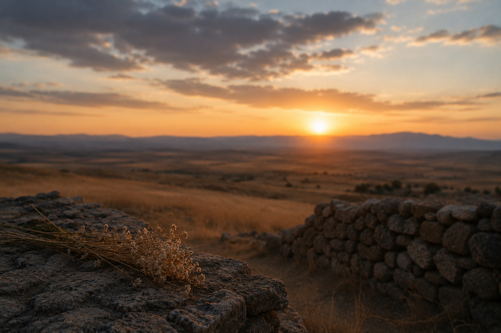

# Aşağıdan, Yukarıdan Yolun Sonu Görünüyor

  Anadolu'ya Veda

{fig-align="center" width="80%"}

Görünen o ki, oldukça güzel ve bir o kadar da garip geçtiğini itiraf etmem gereken lisans hayatımın ve akabindeki gap year dönemimin yavaştan sonuna geliyorum. İçerisindeyken çok şey başarmışım gibi hissettirse de geçmişe dönüp baktığımda kendimi “aslında daha iyisi de olabilirmiş” demekten alıkoyamadığımı söylemem gerekiyor. Maalesef her hareketimi yetersiz görmeme sebep olan bu mükemmeliyetçiliğin üzerimdeki net tesirinin pozitif mi yoksa negatif mi olduğunu hâlâ çözebilmiş değilim. Her ne kadar bu konuda sıkça kafa patlatıyor olsam da bir gün çözüp çözemeyeceğim konusunda da hiçbir fikrim yok.

Bu süreçte kazandığım ve gururla taşıyacağım yegâne şey ise muhtemelen artık kim olduğumu tanımlayabiliyor olmamdır. Karakter gelişiminin asla bitmeyeceğini ve bitmemesi gerektiğini savunsam da bu süreçte hayata bakış açımın ana hatlarının şekillendiğini söyleyebilirim. Elbette bunda en büyük pay, planlı yahut plansız, yollarımın kesiştiği insanlara ait. Bu noktaya ulaşmamda payı olan herkese, kim olduğu fark etmeksizin, son derece minnettar olduğumu özellikle belirtmek isterim. 

Peki, karakter gelişiminden kastım nedir? Nedendir bilinmez, üniversiteye başladığım ilk günü tüm ayrıntılarıyla hatırlıyorum. Bu nedenle, bu yazıyı yazan ben ile o günkü ben arasındaki küçük – büyük tüm farkları görmek oldukça kolay oluyor. Hayattan beklentilerim, ideallerim, bilim anlayışım, hayallerim, planlarım, siyasi görüşüm, insanlara bakış açım, hobilerim, dinlediğim müzikler, okuduğum şiirler… Saydığım ya da sayamadığım pek çok özelliğim zamanla değişti ve sonuç olarak çok daha memnun olduğum bir insan ortaya çıktı. Örnek vermem gerekirse çok değil bir yıl önceki bana sorsanız, yaptığım hiçbir şeyden pişman olmadığımı ve şartlar dahilinde ne gerekiyorsa onu yapmış olduğumu söylerdim. Bunun adını ne koymak gerekir bilmiyorum ancak geç olsa da hayatta yaşadığımız pişmanlıkların da zaruri olduğunu anlamış bulunuyorum. Bu sayede bir teşekkürü de sürecin kendisine borç bilirim. 

Peki sürece niçin teşekkür ediyorum? Özellikle son dönemde, sanki varacağım nokta başından beri belliymiş de ne yaparsam yapayım farklı yollar üzerinden de olsa oraya doğru sürükleniyormuş gibi hissediyorum. Öyle ki, ulaşacağım son nokta hakkında bazı tahminlerim bile var fakat şimdilik bunu zamanla test edeceğim bir hipotez olarak kendime saklamak daha doğru olsa gerek.

Son yazımda yüksek lisans başvurularımdan bahsetmiştim. İyi haber, sonuçlar oldukça iç açıcı. Hemen hemen tüm başvurularımdan pozitif yanıt aldım! Başvuru sürecinde kabul aldığım takdirde ne kadar sevineceğimi hayal bile edemiyordum, fakat insanın düşündüğü gibi olmuyormuş. Nedense çok istediğim şeyler gerçekleştiğinde üzerime istemsiz bir soğukkanlılık çöker ve o sevinci daha başlamadan toprağa gömerim. Maalesef yine aynısı yaşandı, hatta bu kez daha da yoğun bir şekilde. Hangi okulu yahut programı tercih etmem gerektiğine dair karar verme sürecim oldukça sancılı geçti ancak bu yazıyı yazarken kararımı vermiş durumda olduğumu söyleyebilirim. Şimdilik isim vermeyeyim ki sürprizi kaçmasın, ilerleyen zamanlarda bu program hakkında ayrıca bir yazı yazacağım mutlaka.

Şimdi gelelim bu blogun amacına. Tüm hayatımı başarılı bir bilim insanı olmak üzerine şekillendiriyor, yatırımlarımı da bu doğrultuda yapıyorum. Hangi alanda çalışmak istediğime ise çoktan karar vermiş durumdayım. Yüksek lisansımı, bu alanda Avrupa’nın en prestijli programlarından birinde yapacak olmamın bana çok şey katacağı ise aşikâr. Bu nedenle kendimi oldukça mutlu, umutlu ve heyecanlı hissediyorum.

Fakat maalesef ki madalyonun bir de karanlık yüzü var. Aslında bu yazıyı yazmamın temel sebebi de tam olarak bu karanlık taraftan bahsetmek. Bu bir şımarıklık mıdır bilmiyorum ancak şımarabilecek bir hayat hikâyesine sahip olmadığımı da peşinen belirtmek isterim. Sorunumuz, başlıktan da anlaşılabileceği üzere Anadolu’ya veda meselesi. İlk bakışta bu durum bir konfor alanını terk etme sorunu gibi anlaşılabilir, fakat mesele bundan ibaret değil. Zira konfor alanını terk etme konusunda oldukça başarılı bir insan olduğumu söylemeden geçemeyeceğim. Gelecek planlarım arasında Türkiye’ye geri dönmek ve burada yeniden bir hayat kurmak yer almıyor. Dolayısıyla yaşadığım duygunun kaynağı, Anadolu’yu belki de sonsuza dek terk etme fikri.

Anadolu’nun kültürünü, coğrafyasını, bozkırını, türkülerini, mizahını ve felsefesini sevdiğimi elbette biliyordum. Ancak son dönemde bunlar üzerine daha fazla düşünme fırsatı buldum. Meğer Anadolu’nun, pek çok kişinin yüzüne dahi bakmayacağı fakat benim âşık olduğum bozkır toprakları; elindeki son yarım kuru ekmeği de gözünü dahi kırpmadan paylaşan yoksulları; “Ezrailin gelir kendi, Ne ağa der ne efendi, Sayılı günler tükendi, Yolun sonu görünüyor” diyen türküleri; “Ene’l-Hak” diyerek darağacına yürüyen felsefeleri; “Beşikler vermişim Nuh’a, salıncaklar, hamaklar, Havva Ana’n dünkü çocuk sayılır, Anadolu’yum ben, tanıyor musun?” diye seslenen şiirleri; sağında Abdurrahim Karakoç’u, solunda Âşık Mahzuni Şerif’i içimde ne kadar da büyük bir yer kaplıyormuş.

Elbette başka bir ülkede yaşayacak olmam bunlardan kopacağım anlamına gelmiyor. Fakat nedense şu sıralar veda etmek benim için hiç olmadığı kadar zor. Herkes için geçerli midir bilmiyorum ama dünyadaki varlığımızın ancak hatırladığımız anılar kadar olduğuna inanıyorum. Yeni bir sayfa açmak eski anıları silmez belki, fakat zamanla hatırlanmalarını zorlaştırdığı da bir gerçek. Kısacası, bugüne kadar ettiğim en zor veda Anadolu’ya olan sanırım. Zira belki de zamanla içindeki anılara da veda anlamına gelecektir... Yine de yaklaşık on yıl sonrasından bana doğru uzanan bilimin ışığı, madalyonun bu karanlık yüzünü aydınlatacak kadar parlak! 😊

O hâlde bana müsaade! 

Geleneği bozmadan bu defteri de bir şiirle kapatalım.

> **Anadolu**  
>
> Beşikler vermişim Nuh'a  
> Salıncaklar, hamaklar,  
> Havva Ana'n dünkü çocuk sayılır,  
> Anadoluyum ben,  
> Tanıyor musun ?  
>  
> Utanırım,  
> Utanırım fıkaralıktan,  
> Ele, güne karşı çıplak...   
> Üşür fidelerim,  
> Harmanım kesat.  
> Kardeşliğin, çalışmanın,  
> Beraberliğin,  
> Atom güllerinin katmer açtığı,  
> Şairlerin, bilginlerin dünyalarında,            
> Kalmışım bir başıma,  
> Bir başıma ve uzak.  
> Biliyor musun ?  
>  
> Binlerce yıl sağılmışım,  
> Korkunç atlılarıyla parçalamışlar  
> Nazlı, seher-sabah uykularımı  
> Hükümdarlar, saldırganlar, haydutlar,  
> Haraç salmışlar üstüme.  
> Ne İskender takmışım,  
> Ne şah ne sultan  
> Göçüp gitmişler, gölgesiz!  
> Selam etmişim dostuma  
> Ve dayatmışım...  
> Görüyor musun?  
>  
> Nasıl severim bir bilsen.  
> Köroğlu'nu,  
> Karayılanı,  
> Meçhul Askeri...  
> Sonra Pir Sultanı ve Bedrettini.  
> Sonra kalem yazmaz,  
> Bir nice sevda...  
> Bir bilsen,  
> Onlar beni nasıl severdi.  
> Bir bilsen, Urfa'da kurşun atanı  
> Minareden, barikattan,  
> Selvi dalından,  
> Ölüme nasıl gülerdi.  
> Bilmeni mutlak isterim,  
> Duyuyor musun ?  
>  
> Öyle yıkma kendini,  
> Öyle mahzun, öyle garip...  
> Nerede olursan ol,  
> İçerde, dışarda, derste, sırada,  
> Yürü üstüne - üstüne,  
> Tükür yüzüne celladın,  
> Fırsatçının, fesatçının, hayının...  
> Dayan kitap ile  
> Dayan iş ile.  
> Tırnak ile, diş ile,  
> Umut ile, sevda ile, düş ile  
> Dayan rüsva etme beni.  
>  
> Gör, nasıl yeniden yaratılırım,  
> Namuslu, genç ellerinle.  
> Kızlarım,  
> Oğullarım var gelecekte,  
> Herbiri vazgeçilmez cihan parçası.  
> Kaç bin yıllık hasretimin koncası,  
> Gözlerinden,  
> Gözlerinden öperim,  
> Bir umudum sende,  
> Anlıyor musun ?  
>  
> *(Ahmed Arif, **Hasretinden Prangalar Eskittim**)*

Ha son olarak, bir umudum sende! Anlıyor musun?
